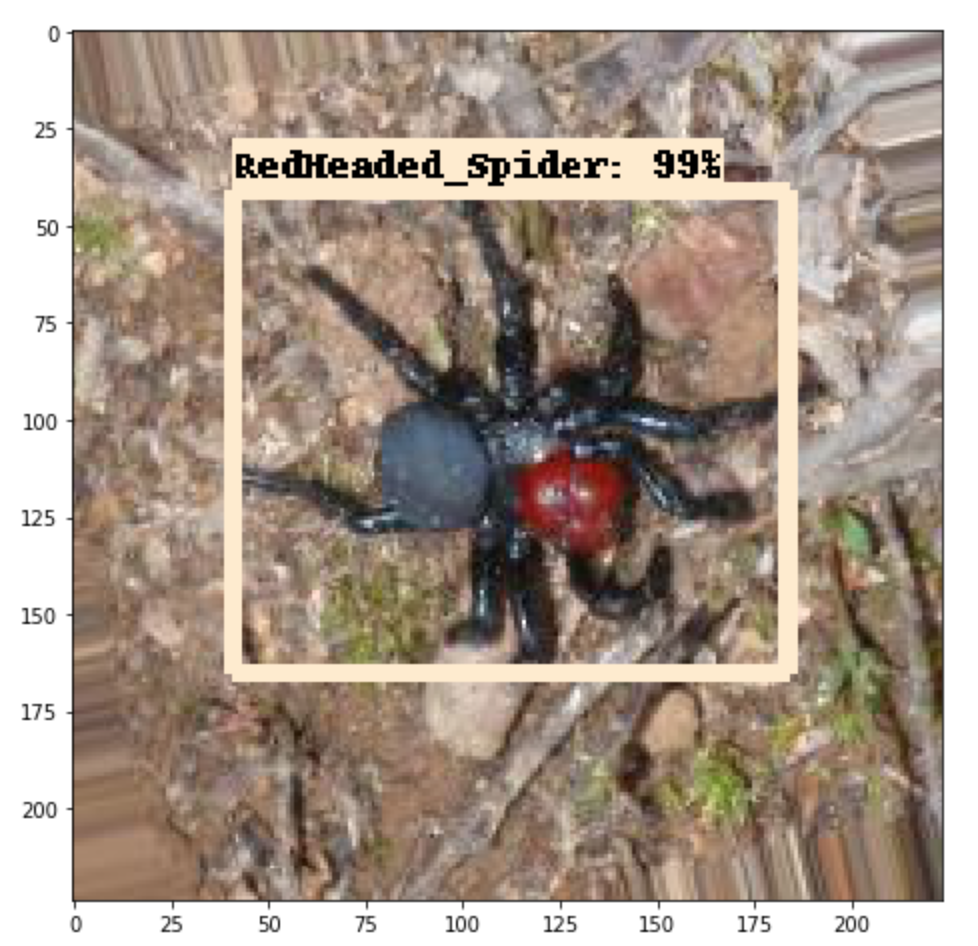

# Poisonous Spider Object Detection
## Step 1: Intallation
Tensorflow Object Detection API depends on many libraries, so first we need to install all of them and set up the environment. Refer to [this](https://github.com/tensorflow/models/blob/master/research/object_detection/g3doc/installation.md) for more information.
## Step 2: Label images
Refer to [this](https://github.com/tzutalin/labelImg) for more information on how to use LabelImg to label images.
## Step 3: Convert to TFRecord file format
Tensorflow Object Detection API requires inputs in TFRecord file format. Thus, in order to use your own dataset, the data must be converted to .record format. Run twice convert_to_tfrecord.py file (once for the training set, once for the testing set), with the following command:
```bash
python convert_to_tfrecord.py 
	--output_path=${your output path} 
	--images_dir=${the path where the data are}
    --labels_dir=${the path where the xml files are}
```
Now, we have train.record and test.record files.
## Step 4: Create a label map
Create a .pbtxt file to record all labels and the format is shown in below:
```
item {
  id: 1
  name: 'Australian_Redback_Spider'
}


item {
  id: 2
  name: 'Australian_Tarantula_Spider'
}
...
```
## Step 5: Train your data
First, download a pretrained model from [this](https://github.com/tensorflow/models/blob/master/research/object_detection/g3doc/detection_model_zoo.md) website and decompress it.

Then, in order to train data, we need to modify paths inside the pipeline.config file. The pipeline.config file is located in the previous downloaded folder. We need to modify:
```
num_classes: 11 #the number of labels in your dataset
```
```
fine_tune_checkpoint: "/The path to the previous downloaded folder/model.ckpt"
```
```
train_input_reader {
  label_map_path: "/path to the label map/spiderlabelmap.pbtxt"
  tf_record_input_reader {
    input_path: "/path to the train.record/train.record"
  }
}
```
```
eval_input_reader {
  label_map_path: "/path to the label map/spiderlabelmap.pbtxt"
  shuffle: false
  num_readers: 1
  tf_record_input_reader {
    input_path: "/path to the test.record/test.record"
  }
}
```
Other things, e.g. learning rate, batch_size, num_steps, can be modified based on your own circumstance.

Then, we can run train the data.
```bash
cd /path to the tensorflow folder/models/research
python object_detection/legacy/train.py \
    --pipeline_config_path=${path to pipeline.config} \
    --train_dir=${path to store your training results} \
    --logtostderr
```
It might take a long time. We can use tensorboard to visualize the training process by using the following command:
```bash
tensorboard --logdir=${path to your previous downloaded model}
```
## Step 6: Convert your model to .pd format
Run the following command to convert your model to .pd format so that we can evaluate it and use it to predict.
```bash
python object_detection/export_inference_graph.py 
	--input_type image_tensor 
    --pipeline_config_path ${path to pipeline.config}  
    --trained_checkpoint_prefix ${path to checkpoint files, e.g. model.ckpt-11665}
    --output_directory ${path to where you save your model}
```
## Step 7: Evaluate your model
Simply, by running:
```bash
python object_detection/legacy/eval.py 
	--pipeline_config_path ${path to pipeline.config}
    --checkpoint_dir ${path to the folder that stores checkpoint files} 
    --eval_dir ${path to store evaluation results}
```
## Step 8: Prediction
Open object.ipynb file and change PATH_TO_FROZEN_GRAPH, PATH_TO_LABELS and PATH_TO_TEST_IMAGES_DIR. Then, you can visualize the results, e.g. 

